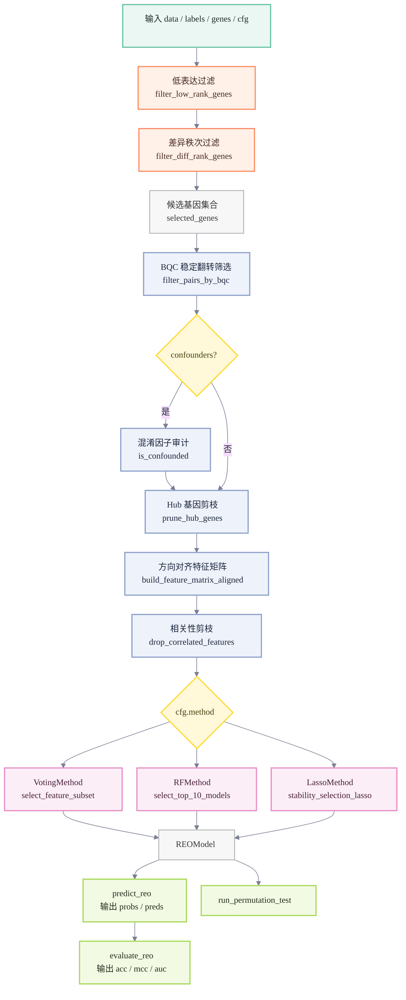

# REOB: Relative Expression Ordering-based Biomarker Identification

REOB（Relative Expression Ordering-based Biomarker identification algorithm）是一个 Julia 实现的二分类生物标志识别算法包。它基于基因对表达秩序关系（Relative Expression Ordering，REO），筛选在对照组（阴性样本）中表达秩序稳定、但在病例组（阳性样本）中秩序关系反转的基因对，用于样本分类预测。

REO 方法使用样本内基因作为参照，不依赖基因表达绝对值，因此通常不需要对原始数据做批次校正，适合跨数据集和跨定量技术平台的建模场景。除基因表达矩阵外，同样的输入结构也可用于蛋白表达矩阵等连续定量数据。

REOB 包实现了模型训练、验证评估、显著性检验等功能模块，并提供文献中的 TSP、k-TSP 和 AUC-TSP 作为传统秩序基因对筛选基线方法。

## 算法原理

对样本 $s$ 和第 $i$ 个方向已对齐的基因对 $(A_i, B_i)$，REOB 将其转换为二值特征：

$$
x_i(s) = \mathbf{1}\{E_{A_i,s} > E_{B_i,s}\}
$$

其中 $E_{A_i,s}$ 和 $E_{B_i,s}$ 分别表示样本 $s$ 中基因 $A_i$ 与 $B_i$ 的表达量；$x_i(s)=1$ 表示该基因对支持阳性类别，$x_i(s)=0$ 表示不支持阳性类别。

REOB 支持三种基于 REO 特征的分类策略：

- `VotingMethod`：多数投票方法。若最终选择 $n$ 个基因对，则样本评分为

$$
\text{score}(s) = \frac{1}{n}\sum_{i=1}^{n} x_i(s) + b
$$

其中 $b$ 为训练阶段根据投票阈值校准得到的偏置；当 $b=0$ 时，该式退化为普通等权多数投票。

- `RFMethod`：基于随机森林树桩筛选稳定基因对，并使用归一化特征重要性作为权重：

$$
\text{score}(s) = \sum_{i=1}^{n} w_i x_i(s), \qquad
w_i \ge 0,\quad \sum_{i=1}^{n} w_i = 1
$$

- `LassoMethod`：使用 Lasso/Elastic Net 路径进行稳定性选择，并通过 Logistic 映射输出阳性概率：

$$
\text{score}(s) =
\sigma\left(\sum_{i=1}^{n} w_i x_i(s) + b\right), \qquad
\sigma(z)=\frac{1}{1+\exp(-z)}
$$

最终分类规则为：

$$
\hat{y}(s)=
\begin{cases}
1, & \text{score}(s) \ge 0.5,\\
0, & \text{score}(s) < 0.5.
\end{cases}
$$

## 数据约定

模型训练时，需要如下三种数据。

- 表达矩阵 `data` 使用 `基因 × 样本` 布局。
- 标签 `labels` 为二分类向量，取值为 `0` 和 `1`，与 `data` 的列顺序一一对应。
- 基因名 `genes` 与 `data` 的行顺序一一对应。

## 快速开始

```julia
using REOB

# 生成模拟数据
data, labels, genes = generate_test_data(1000, 200)

# 参数配置
cfg = REOConfig(
    method = VotingMethod,
    bqc_threshold = 2.0,
    p0_threshold = 0.1,
)

# 训练
model = fit_reo(data, labels, genes, cfg)

# 预测
pred = predict_reo(model, data, genes)

# 评估
metrics = evaluate_reo(model, data, genes, labels)
```

## REOB 基本流程

1. 低表达过滤：按样本内表达秩分位去除低表达基因。
2. 差异秩次过滤：保留两类样本平均秩分位差异较大的基因。
3. BQC 过滤：基于贝叶斯质量控制筛选稳定翻转的基因对。
4. 混淆因子审计(可选)：剔除与协变量显著相关的基因对。
5. hub 基因剪枝：限制同一基因重复出现在过多候选对子中。
6. 特征构建与方向对齐：将基因对序关系转换为样本级二值特征。
7. 模型训练：支持 `VotingMethod`、`RFMethod` 和 `LassoMethod`。



## 主要 API

| API | 说明 |
| --- | --- |
| `REOConfig` | REOB 训练配置 |
| `fit_reo` | 训练 REOB 模型 |
| `predict_reo` | 返回预测概率/投票分数和布尔预测 |
| `evaluate_reo` | 返回准确率、MCC、AUC 和预测结果 |
| `run_permutation_test` | 通过标签置换估计观测 MCC 的显著性 |
| `fit_tsp` / `predict_tsp` / `evaluate_tsp` | TSP 基线 |
| `fit_ktsp` / `predict_ktsp` / `evaluate_ktsp` | k-TSP 基线 |
| `fit_auctsp` / `predict_auctsp` / `evaluate_auctsp` | AUC-TSP 基线 |

## 测试

```bash
julia --project=REOB -e 'using Pkg; Pkg.test()'
```

测试覆盖 REOB 训练/预测/评估、过滤流程、置换检验、TSP 系列模型和多数投票特征搜索。

## REOConfig 参数说明

本文档按当前实现说明 `REOConfig` 参数的实际作用。重点注意：字段存在不等于训练代码已经读取，调参应以源码实际使用情况为准。

### 参数说明

#### `method`

默认值为 `RFMethod`。只对 `fit_reo` 生效，用来选择 `VotingMethod`、`RFMethod` 或 `LassoMethod` 分支；TSP、k-TSP、AUC-TSP 不读取该参数。需要规则最透明时选 `VotingMethod`，需要树桩加权模型时选 `RFMethod`，需要稀疏线性权重时选 `LassoMethod`。

#### `low_rank_q`

默认值为 `0.2`。用于低表达秩过滤，`fit_reo` 和 TSP 系列都会使用。推荐范围是 `0.0 <= low_rank_q < 1.0`；候选基因太少时降到 `0.1` 或 `0.0`，低表达噪声较多时可升到 `0.3` 左右。

#### `top_diff_n`

默认值为 `5000`。用于保留两类平均秩差最大的前 N 个基因，`fit_reo` 和 TSP 系列都会使用。必须是正整数；值越大越慢，因为候选基因对规模约为 `N*(N-1)/2`。调试可用 `100-1000`，常规 REOB 可用 `1000-5000`，TSP 系列建议更小。

#### `bqc_threshold`

默认值为 `3.0`。用于 REOB 主流程的 BQC 稳定翻转基因对过滤；Voting、RF、Lasso 都会间接受影响，TSP 系列不使用。该值越大越严格；BQC 后没有基因对时可降到 `2.0` 或 `1.0`，候选过多时可升高。

#### `p0_threshold`

默认值为 `0.2`。用于要求对照组序关系远离 `0.5`，只在 REOB 主流程的 BQC 阶段生效。推荐范围是 `0.0 <= p0_threshold < 0.5`；默认相当于保留 `p0 <= 0.3` 或 `p0 >= 0.7` 的稳定关系。无基因对时降低，候选太多时升高。

#### `p_val_cutoff`

默认值为 `0.05`。仅当调用 `fit_reo(...; confounders=...)` 时生效，用于混淆因子审计。常用范围是 `0.01-0.1`；值越大，剔除与协变量相关的可疑基因对越多。

#### `max_occurrence`

默认值为 `2`。限制单个基因最多出现在多少个候选基因对中，只在 REOB 主流程生效。必须是正整数；解释性优先可用 `1-2`，最终特征太少时可升到 `3-5`。

#### `cor_threshold`

默认值为 `0.90`。用于删除高度相关的二值 REO 特征，只在 REOB 主流程生效。推荐范围是 `0.8-0.99`；值越低剪枝越强，特征太少时升高。

#### `ss_iterations`

默认值为 `1000`。RF 和 Lasso 会读取，用于子采样迭代次数；VotingMethod 不使用子采样，因此无需设置。调试可用 `5-50`，常规可用 `300-1000`；值越大结果越稳定，但运行越慢。

#### `ss_ratio`

默认值为 `0.8`。RF 和 Lasso 会读取，用于每轮分层子采样比例；VotingMethod 无需设置。推荐范围是 `0.5 < ss_ratio < 1.0`；小样本可用 `0.6-0.75` 保留 OOB 样本，不建议设为 `1.0`。

#### `ss_threshold`

默认值为 `0.7`。当前只在 LassoMethod 中用于稳定性选择阈值；VotingMethod 和 RFMethod 都无需设置。推荐范围是 `0.0-1.0`；Lasso 选不到特征时降低，特征太多时升高。

#### `target_n`

默认值为 `15`。当前 RF 和 Lasso 会读取；VotingMethod 不读取，因此不能用它直接控制 Voting 的最终特征数。必须是正整数，常用 `5-30`；RF 中也影响每轮森林规模，Lasso 中用于选择路径位置和 fallback 数量。

#### `fisher_n_top`

默认值为 `5000`。这是 Fisher 基因对筛选的预留参数；当前 `fit_reo` 主流程使用 BQC，不读取该字段，通常不用设置。

#### `verbose`

默认值为 `false`。用于控制筛选、训练和部分评估日志。调试时设为 `true`，批量运行时保持 `false`。

### 按算法推荐配置

#### VotingMethod

```julia
cfg = REOConfig(
    method = VotingMethod,
    low_rank_q = 0.2,
    top_diff_n = 1000,
    bqc_threshold = 2.0,
    p0_threshold = 0.1,
    max_occurrence = 2,
    cor_threshold = 0.90,
)
```

说明：VotingMethod 当前不使用子采样，`ss_iterations`、`ss_ratio`、`ss_threshold` 无需设置；`target_n` 也不直接控制最终特征数。若候选特征超过 `128`，算法选取前 BQC打分前`128` 个基因对，进入 Voting 模型构建。

#### RFMethod

```julia
cfg = REOConfig(
    method = RFMethod,
    ss_iterations = 500,
    ss_ratio = 0.8,
    target_n = 15,
)
```

说明：RF 读取 `ss_iterations`、`ss_ratio`、`target_n`。

#### LassoMethod

```julia
cfg = REOConfig(
    method = LassoMethod,
    ss_iterations = 500,
    ss_ratio = 0.75,
    ss_threshold = 0.6,
    target_n = 15,
)
```

说明：Lasso 读取 `ss_iterations`、`ss_ratio`、`ss_threshold`、`target_n`。

#### TSP / k-TSP / AUC-TSP

```julia
cfg = REOConfig(
    low_rank_q = 0.0,
    top_diff_n = 500,
)
```

说明：TSP 系列只使用 `low_rank_q`、`top_diff_n` 和预筛选日志相关的 `verbose`。`method`、BQC、`ss_`、`target_n` 等参数都不影响 TSP 系列；`fit_ktsp` 和 `fit_auctsp` 的对子数量由函数参数 `k_max` 控制。

### 常见调参方向

- BQC 后没有基因对：先降低 `bqc_threshold`，再降低 `p0_threshold`，必要时降低 `low_rank_q` 或增加 `top_diff_n`。
- 运行太慢：优先降低 `top_diff_n`；RF/Lasso 可降低 `ss_iterations`。
- 候选特征过多：升高 `bqc_threshold` 或 `p0_threshold`，降低 `max_occurrence` 或 `cor_threshold`。
- 结果波动大：固定随机种子，并增加 `ss_iterations`。
