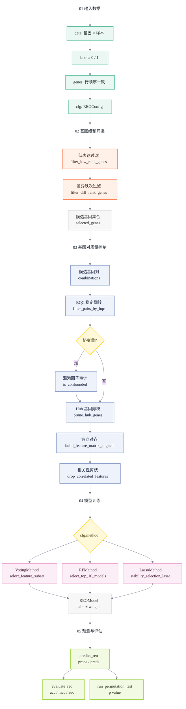

# REOB 文档

REOB（Relative Expression Ordering-based Biomarker identification algorithm）是一个 Julia 实现的二分类生物标志识别算法包。它基于基因对表达秩序关系（Relative Expression Ordering，REO），筛选在对照组（阴性样本）中表达秩序稳定、但在病例组（阳性样本）中秩序关系反转的基因对，用于样本分类预测。

REO 方法使用样本内基因作为参照，不依赖基因表达绝对值，因此通常不需要对原始数据做批次校正，适合跨数据集和跨定量技术平台的建模场景。除基因表达矩阵外，同样的输入结构也可用于蛋白表达矩阵等连续定量数据。

REOB 包实现了模型训练、验证评估、显著性检验等功能模块，并提供文献中的 TSP、k-TSP 和 AUC-TSP 作为传统秩序基因对筛选基线方法。

## 算法原理

```@raw html
<p>对样本 <math><mi>s</mi></math> 和第 <math><mi>i</mi></math> 个方向已对齐的基因对 <math><mo stretchy="false">(</mo><msub><mi>A</mi><mi>i</mi></msub><mo>,</mo><msub><mi>B</mi><mi>i</mi></msub><mo stretchy="false">)</mo></math>，REOB 将其转换为二值特征：</p>
```

```@raw html
<div class="math-display">
<math display="block">
  <mrow>
    <msub><mi>x</mi><mi>i</mi></msub><mo stretchy="false">(</mo><mi>s</mi><mo stretchy="false">)</mo>
    <mo>=</mo>
    <mi mathvariant="bold">1</mi><mo>{</mo>
    <msub><mi>E</mi><mrow><msub><mi>A</mi><mi>i</mi></msub><mo>,</mo><mi>s</mi></mrow></msub>
    <mo>&gt;</mo>
    <msub><mi>E</mi><mrow><msub><mi>B</mi><mi>i</mi></msub><mo>,</mo><mi>s</mi></mrow></msub>
    <mo>}</mo>
  </mrow>
</math>
</div>
```

```@raw html
<p>其中 <math><msub><mi>E</mi><mrow><msub><mi>A</mi><mi>i</mi></msub><mo>,</mo><mi>s</mi></mrow></msub></math> 和 <math><msub><mi>E</mi><mrow><msub><mi>B</mi><mi>i</mi></msub><mo>,</mo><mi>s</mi></mrow></msub></math> 分别表示样本 <math><mi>s</mi></math> 中基因 <math><msub><mi>A</mi><mi>i</mi></msub></math> 与 <math><msub><mi>B</mi><mi>i</mi></msub></math> 的表达量；<math><msub><mi>x</mi><mi>i</mi></msub><mo stretchy="false">(</mo><mi>s</mi><mo stretchy="false">)</mo><mo>=</mo><mn>1</mn></math> 表示该基因对支持阳性类别，<math><msub><mi>x</mi><mi>i</mi></msub><mo stretchy="false">(</mo><mi>s</mi><mo stretchy="false">)</mo><mo>=</mo><mn>0</mn></math> 表示不支持阳性类别。</p>
```

REOB 支持三种基于 REO 特征的分类策略：

```@raw html
<ul><li><code>VotingMethod</code>：多数投票方法。若最终选择 <math><mi>n</mi></math> 个基因对，则样本评分为</li></ul>
```

```@raw html
<div class="math-display">
<math display="block">
  <mrow>
    <mi mathvariant="normal">score</mi><mo stretchy="false">(</mo><mi>s</mi><mo stretchy="false">)</mo>
    <mo>=</mo>
    <mfrac><mn>1</mn><mi>n</mi></mfrac>
    <munderover>
      <mo>&sum;</mo>
      <mrow><mi>i</mi><mo>=</mo><mn>1</mn></mrow>
      <mi>n</mi>
    </munderover>
    <msub><mi>x</mi><mi>i</mi></msub><mo stretchy="false">(</mo><mi>s</mi><mo stretchy="false">)</mo>
    <mo>+</mo><mi>b</mi>
  </mrow>
</math>
</div>
```

```@raw html
<p>其中 <math><mi>b</mi></math> 为训练阶段根据投票阈值校准得到的偏置；当 <math><mi>b</mi><mo>=</mo><mn>0</mn></math> 时，该式退化为普通等权多数投票。</p>
```

- `RFMethod`：基于随机森林树桩筛选稳定基因对，并使用归一化特征重要性作为权重：

```@raw html
<div class="math-display">
<math display="block">
  <mrow>
    <mi mathvariant="normal">score</mi><mo stretchy="false">(</mo><mi>s</mi><mo stretchy="false">)</mo>
    <mo>=</mo>
    <munderover>
      <mo>&sum;</mo>
      <mrow><mi>i</mi><mo>=</mo><mn>1</mn></mrow>
      <mi>n</mi>
    </munderover>
    <msub><mi>w</mi><mi>i</mi></msub>
    <msub><mi>x</mi><mi>i</mi></msub><mo stretchy="false">(</mo><mi>s</mi><mo stretchy="false">)</mo>
    <mo>,</mo>
    <mspace width="1em" />
    <msub><mi>w</mi><mi>i</mi></msub><mo>&ge;</mo><mn>0</mn>
    <mo>,</mo>
    <mspace width="1em" />
    <munderover>
      <mo>&sum;</mo>
      <mrow><mi>i</mi><mo>=</mo><mn>1</mn></mrow>
      <mi>n</mi>
    </munderover>
    <msub><mi>w</mi><mi>i</mi></msub>
    <mo>=</mo><mn>1</mn>
  </mrow>
</math>
</div>
```

- `LassoMethod`：使用 Lasso/Elastic Net 路径进行稳定性选择，并通过 Logistic 映射输出阳性概率：

```@raw html
<div class="math-display">
<math display="block">
  <mrow>
    <mi mathvariant="normal">score</mi><mo stretchy="false">(</mo><mi>s</mi><mo stretchy="false">)</mo>
    <mo>=</mo>
    <mi>&sigma;</mi><mo stretchy="false">(</mo>
    <munderover>
      <mo>&sum;</mo>
      <mrow><mi>i</mi><mo>=</mo><mn>1</mn></mrow>
      <mi>n</mi>
    </munderover>
    <msub><mi>w</mi><mi>i</mi></msub>
    <msub><mi>x</mi><mi>i</mi></msub><mo stretchy="false">(</mo><mi>s</mi><mo stretchy="false">)</mo>
    <mo>+</mo><mi>b</mi><mo stretchy="false">)</mo>
    <mo>,</mo>
    <mspace width="1em" />
    <mi>&sigma;</mi><mo stretchy="false">(</mo><mi>z</mi><mo stretchy="false">)</mo>
    <mo>=</mo>
    <mfrac>
      <mn>1</mn>
      <mrow>
        <mn>1</mn><mo>+</mo>
        <mi mathvariant="normal">exp</mi><mo stretchy="false">(</mo><mo>-</mo><mi>z</mi><mo stretchy="false">)</mo>
      </mrow>
    </mfrac>
  </mrow>
</math>
</div>
```

最终分类规则为：

```@raw html
<div class="math-display">
<math display="block">
  <mrow>
    <mover accent="true"><mi>y</mi><mo>^</mo></mover><mo stretchy="false">(</mo><mi>s</mi><mo stretchy="false">)</mo>
    <mo>=</mo>
    <mrow>
      <mo stretchy="true">{</mo>
      <mtable columnalign="left left">
        <mtr>
          <mtd><mn>1</mn><mo>,</mo></mtd>
          <mtd>
            <mtext>if</mtext><mspace width="0.35em" />
            <mi mathvariant="normal">score</mi><mo stretchy="false">(</mo><mi>s</mi><mo stretchy="false">)</mo>
            <mo>&ge;</mo><mn>0.5</mn>
          </mtd>
        </mtr>
        <mtr>
          <mtd><mn>0</mn><mo>,</mo></mtd>
          <mtd>
            <mtext>if</mtext><mspace width="0.35em" />
            <mi mathvariant="normal">score</mi><mo stretchy="false">(</mo><mi>s</mi><mo stretchy="false">)</mo>
            <mo>&lt;</mo><mn>0.5</mn>
          </mtd>
        </mtr>
      </mtable>
    </mrow>
  </mrow>
</math>
</div>
```

## 输入格式

所有训练和预测入口都采用以下约定：

```julia
data::Matrix      # 基因 × 样本
labels::Vector    # 样本标签，取值为 0/1，与 data 列顺序一致
genes::Vector     # 基因名称，与 data 行顺序一致
```

## REOB 训练流程

```julia
using REOB

data, labels, genes = generate_test_data(1000, 200)
cfg = REOConfig(
    method=VotingMethod,
    bqc_threshold=2.0,
    p0_threshold=0.1,
)

model = fit_reo(data, labels, genes, cfg)
```

训练入口 `fit_reo` 会执行：

1. `filter_low_rank_genes`：去除低表达秩基因。
2. `filter_diff_rank_genes`：按两类平均秩差做基因预筛选。
3. `filter_pairs_by_bqc`：筛选在对照组稳定、在病例组稳定翻转的基因对。
4. 可选混淆因子审计：剔除与协变量显著相关的基因对。
5. `prune_hub_genes`：限制单个基因在多个对子中过度出现。
6. `build_feature_matrix_aligned`：生成方向与正类对齐的二值特征。
7. `drop_correlated_features`：删除高度相关的冗余基因对。
8. 根据 `cfg.method` 调用 Voting、Random Forest 或 Lasso 策略。

下图按输入、预筛选、质量控制、建模和输出五个阶段纵向展开。阶段名作为流程节点参与排版，避免分组标题压住跨阶段箭头。



| 阶段 | 关键输入或函数 | 主要产出 |
| --- | --- | --- |
| 01 输入数据 | `data`、`labels`、`genes`、`cfg` | 训练所需的表达矩阵、标签、基因名和配置 |
| 02 基因级预筛选 | `filter_low_rank_genes`、`filter_diff_rank_genes` | 候选基因集合 `selected_genes` |
| 03 基因对质量控制 | `filter_pairs_by_bqc`、`is_confounded`、`prune_hub_genes`、`build_feature_matrix_aligned`、`drop_correlated_features` | 方向对齐、去冗余的最终特征对 |
| 04 模型训练 | `VotingMethod`、`RFMethod`、`LassoMethod` | `REOModel` |
| 05 预测与评估 | `predict_reo`、`evaluate_reo`、`run_permutation_test` | 预测结果、指标和置换检验结果 |

## 预测与评估

```julia
pred = predict_reo(model, data, genes)
metrics = evaluate_reo(model, data, genes, labels)
```

`predict_reo` 返回：

- `probs`：Lasso 使用 sigmoid 概率，Voting/RF 使用加权投票分数。
- `preds`：阈值为 `0.5` 的布尔预测。

`evaluate_reo` 返回：

- `acc`：准确率。
- `mcc`：Matthews correlation coefficient。
- `auc`：二分类 AUC。
- `probs` 和 `preds`：预测输出。

## 传统 TSP 方法

包内提供三个基线方法：

```julia
cfg = REOConfig(low_rank_q=0.0, top_diff_n=500)

tsp = fit_tsp(data, labels, genes, cfg)
evaluate_tsp(tsp, data, genes, labels)

ktsp = fit_ktsp(data, labels, genes, cfg; k_max=9)
evaluate_ktsp(ktsp, data, genes, labels)

auctsp = fit_auctsp(data, labels, genes, cfg; k_max=9)
evaluate_auctsp(auctsp, data, genes, labels)
```

## REOConfig 参数说明

本文档按当前实现说明 `REOConfig` 参数的实际作用。重点注意：字段存在不等于训练代码已经读取，调参应以源码实际使用情况为准。

### 参数说明

#### `method`

默认值为 `RFMethod`。只对 `fit_reo` 生效，用来选择 `VotingMethod`、`RFMethod` 或 `LassoMethod` 分支；TSP、k-TSP、AUC-TSP 不读取该参数。需要规则最透明时选 `VotingMethod`，需要树桩加权模型时选 `RFMethod`，需要稀疏线性权重时选 `LassoMethod`。

#### `low_rank_q`

默认值为 `0.2`。用于低表达秩过滤，`fit_reo` 和 TSP 系列都会使用。推荐范围是 `0.0 <= low_rank_q < 1.0`；候选基因太少时降到 `0.1` 或 `0.0`，低表达噪声较多时可升到 `0.3` 左右。

#### `top_diff_n`

默认值为 `5000`。用于保留两类平均秩差最大的前 N 个基因，`fit_reo` 和 TSP 系列都会使用。必须是正整数；值越大越慢，因为候选基因对规模约为 `N*(N-1)/2`。调试可用 `100-1000`，常规 REOB 可用 `1000-5000`，TSP 系列建议更小。

#### `bqc_threshold`

默认值为 `3.0`。用于 REOB 主流程的 BQC 稳定翻转基因对过滤；Voting、RF、Lasso 都会间接受影响，TSP 系列不使用。该值越大越严格；BQC 后没有基因对时可降到 `2.0` 或 `1.0`，候选过多时可升高。

#### `p0_threshold`

默认值为 `0.2`。用于要求对照组序关系远离 `0.5`，只在 REOB 主流程的 BQC 阶段生效。推荐范围是 `0.0 <= p0_threshold < 0.5`；默认相当于保留 `p0 <= 0.3` 或 `p0 >= 0.7` 的稳定关系。无基因对时降低，候选太多时升高。

#### `p_val_cutoff`

默认值为 `0.05`。仅当调用 `fit_reo(...; confounders=...)` 时生效，用于混淆因子审计。常用范围是 `0.01-0.1`；值越大，剔除与协变量相关的可疑基因对越多。

#### `max_occurrence`

默认值为 `2`。限制单个基因最多出现在多少个候选基因对中，只在 REOB 主流程生效。必须是正整数；解释性优先可用 `1-2`，最终特征太少时可升到 `3-5`。

#### `cor_threshold`

默认值为 `0.90`。用于删除高度相关的二值 REO 特征，只在 REOB 主流程生效。推荐范围是 `0.8-0.99`；值越低剪枝越强，特征太少时升高。

#### `ss_iterations`

默认值为 `1000`。RF 和 Lasso 会读取，用于子采样迭代次数；VotingMethod 不使用子采样，因此无需设置。调试可用 `5-50`，常规可用 `300-1000`；值越大结果越稳定，但运行越慢。

#### `ss_ratio`

默认值为 `0.8`。RF 和 Lasso 会读取，用于每轮分层子采样比例；VotingMethod 无需设置。推荐范围是 `0.5 < ss_ratio < 1.0`；小样本可用 `0.6-0.75` 保留 OOB 样本，不建议设为 `1.0`。

#### `ss_threshold`

默认值为 `0.7`。当前只在 LassoMethod 中用于稳定性选择阈值；VotingMethod 和 RFMethod 都无需设置。推荐范围是 `0.0-1.0`；Lasso 选不到特征时降低，特征太多时升高。

#### `target_n`

默认值为 `15`。当前 RF 和 Lasso 会读取；VotingMethod 不读取，因此不能用它直接控制 Voting 的最终特征数。必须是正整数，常用 `5-30`；RF 中也影响每轮森林规模，Lasso 中用于选择路径位置和 fallback 数量。

#### `fisher_n_top`

默认值为 `5000`。这是 Fisher 基因对筛选的预留参数；当前 `fit_reo` 主流程使用 BQC，不读取该字段，通常不用设置。

#### `forest_trees`

默认值为 `100`。这是 RF 树数量的预留参数；当前 RF 代码不读取，通常不用设置。

#### `forest_depth`

默认值为 `1`。这是 RF 深度的预留参数；当前 RF 固定使用树桩深度，不读取该字段。

#### `lasso_lambda`

默认值为 `:min`。这是 Lasso lambda 选择策略的预留参数；当前 Lasso 代码不读取，通常不用设置。

#### `verbose`

默认值为 `false`。用于控制筛选、训练和部分评估日志。调试时设为 `true`，批量运行时保持 `false`。

### 按算法推荐配置

#### VotingMethod

```julia
cfg = REOConfig(
    method = VotingMethod,
    low_rank_q = 0.2,
    top_diff_n = 1000,
    bqc_threshold = 2.0,
    p0_threshold = 0.1,
    max_occurrence = 2,
    cor_threshold = 0.90,
)
```

说明：VotingMethod 当前不使用子采样，`ss_iterations`、`ss_ratio`、`ss_threshold` 无需设置；`target_n` 也不直接控制最终特征数。若候选特征超过 `128`，代码会先截取前 `128` 个再进入 Voting 搜索。

#### RFMethod

```julia
cfg = REOConfig(
    method = RFMethod,
    ss_iterations = 500,
    ss_ratio = 0.8,
    target_n = 15,
)
```

说明：RF 读取 `ss_iterations`、`ss_ratio`、`target_n`。当前不读取 `ss_threshold`、`forest_trees`、`forest_depth`。

#### LassoMethod

```julia
cfg = REOConfig(
    method = LassoMethod,
    ss_iterations = 500,
    ss_ratio = 0.75,
    ss_threshold = 0.6,
    target_n = 15,
)
```

说明：Lasso 读取 `ss_iterations`、`ss_ratio`、`ss_threshold`、`target_n`。当前不读取 `lasso_lambda`。

#### TSP / k-TSP / AUC-TSP

```julia
cfg = REOConfig(
    low_rank_q = 0.0,
    top_diff_n = 500,
)
```

说明：TSP 系列只使用 `low_rank_q`、`top_diff_n` 和预筛选日志相关的 `verbose`。`method`、BQC、`ss_`、`target_n` 等参数都不影响 TSP 系列；`fit_ktsp` 和 `fit_auctsp` 的对子数量由函数参数 `k_max` 控制。

### 常见调参方向

- BQC 后没有基因对：先降低 `bqc_threshold`，再降低 `p0_threshold`，必要时降低 `low_rank_q` 或增加 `top_diff_n`。
- 运行太慢：优先降低 `top_diff_n`；RF/Lasso 可降低 `ss_iterations`。
- 候选特征过多：升高 `bqc_threshold` 或 `p0_threshold`，降低 `max_occurrence` 或 `cor_threshold`。
- 结果波动大：固定随机种子，并增加 `ss_iterations`。

## 包测试

```bash
julia --project=REOB -e 'using Pkg; Pkg.test()'
```

测试使用 Julia 标准库 `Test`，以行为断言为主，避免依赖内部实现细节。
